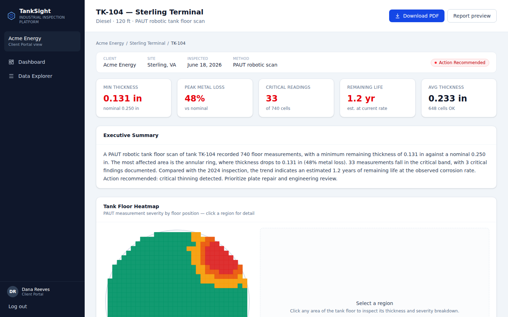
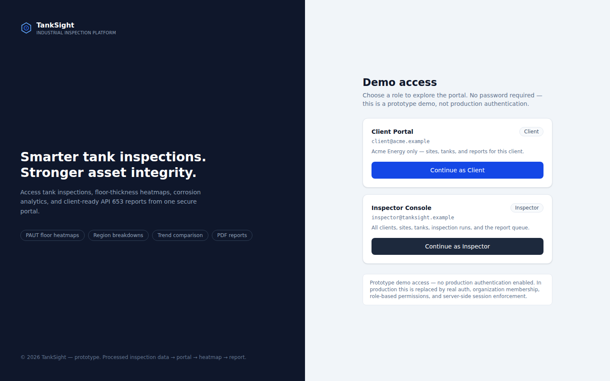
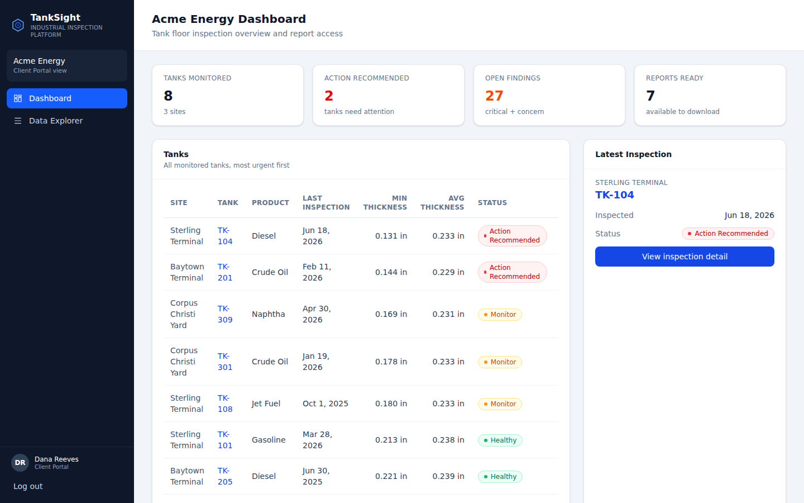
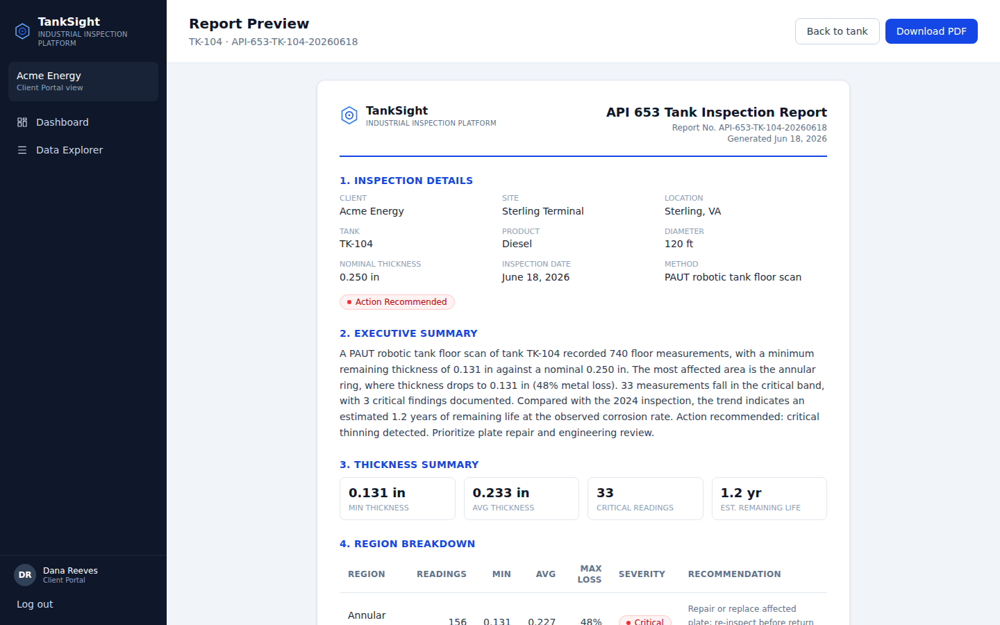
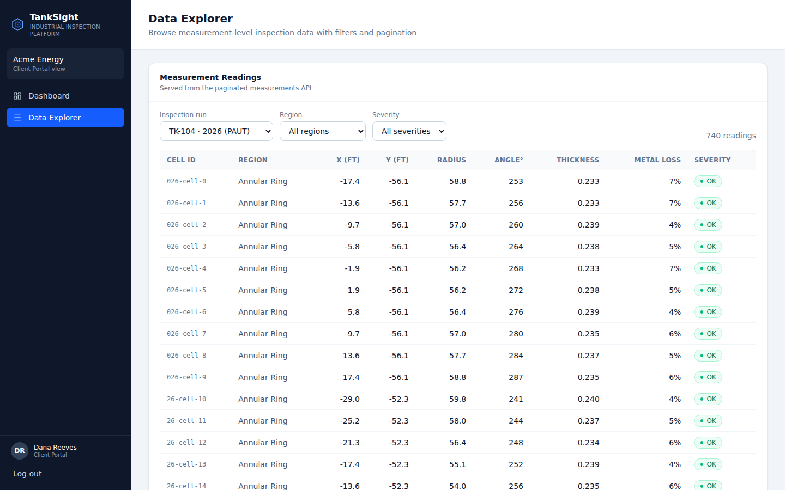

# TankSight — Inspection Reporting & Client Portal (Prototype)

A focused full-stack prototype that shows how **processed PAUT tank-floor inspection
data** becomes a client-facing product: a portal → interactive floor heatmaps →
region/trend analysis → downloadable **API 653-style PDF reports**.

Built to demonstrate how I structure a real data/reporting application end to end —
from the data layer, through a service/domain layer, to APIs, a data-dense UI, and a
document-generation pipeline.

> **This is a data & reporting prototype, not a marketing site.** Reliability and
> correctness are the point. It uses mock **already-processed** PAUT-style data — no
> raw ultrasonic signal processing, no certified API 653 calculations.



---

## What it demonstrates

| Capability | Status |
| --- | --- |
| Client portal with role-based access | ✅ implemented |
| Tank / site / inspection history | ✅ implemented |
| Interactive tank-floor heatmap (canvas / Konva) | ✅ implemented |
| Region-level thickness & corrosion breakdown | ✅ implemented |
| Trend comparison across inspection runs (Chart.js) | ✅ implemented |
| Client-ready PDF report generation (@react-pdf/renderer) | ✅ implemented |
| Backend JSON APIs (Next.js Route Handlers) | ✅ implemented |
| Paginated / filterable measurement data explorer | ✅ implemented |
| MongoDB persistence + real aggregation pipeline | ✅ implemented (opt-in) |
| Role / client data scoping | ✅ enforced in the data layer |
| Domain unit tests (Vitest) | ✅ 22 tests |

## Screens

| | |
| --- | --- |
|  |  |
|  |  |

---

## Tech stack

- **Framework:** Next.js 16 (App Router), React 19, TypeScript (strict)
- **Styling:** Tailwind CSS v4
- **Visualization:** Konva (canvas heatmap), Chart.js (trend)
- **PDF:** `@react-pdf/renderer` (Node runtime)
- **Database:** MongoDB (driver + real aggregation pipeline); in-memory by default so
  the app runs with zero setup
- **Testing:** Vitest
- **Tooling:** `tsx` for scripts

## Run locally

```bash
npm install
npm run dev          # http://localhost:3000  (in-memory data, no DB required)
```

Then open `/login` and choose **Continue as Client** or **Continue as Inspector**.

Other scripts:

```bash
npm run build        # production build
npm run test         # domain unit tests (Vitest)
npm run typecheck    # tsc --noEmit
npm run export:seed  # export the mock collections to ./seed-export (JSON + CSV)
npm run db:seed      # load the seed data into MongoDB Atlas (see below)
```

## Demo walkthrough

1. Open `/login` → **Continue as Client** (scoped to Acme Energy).
2. Review the **Acme Energy dashboard** (summary cards, latest inspection, tank table).
3. Open **Sterling Terminal** → open **TK-104** (the showcase tank).
4. Inspect the **tank-floor heatmap**; click the red corrosion cluster (NE annular
   ring) to see the region's thickness and severity breakdown.
5. Read the **region breakdown table** and **2024 → 2026 trend**.
6. Open **Report preview**, then **Download PDF** — both render from the same data.
7. Open **Data Explorer** to filter/paginate raw measurement readings.
8. Log out → **Continue as Inspector** to see the cross-client console and report queue.
9. Run `npm run export:seed` to review the underlying mock data.

---

## Architecture

Strictly layered so business logic never leaks into pages or components:

```
UI routes (app/)
  → page-level server components
    → feature components (components/)
      → API route handlers (app/api/)         ← JSON + PDF
        → application services (lib/services/) ← use-case orchestration
          → domain functions (lib/domain/)     ← inspection math, severity, trends
            → repository (lib/data/)           ← the ONLY place that reads collections
              → seed collections  |  MongoDB
```

Rules the codebase follows:

- Pages load data through **services**, never from seed arrays directly.
- **Domain** holds all inspection calculations (severity, metrics, remaining life,
  trends) and is pure + unit-tested.
- The **repository** is the single data-access boundary. It's an interface with two
  implementations (`InMemoryRepository`, `MongoRepository`) — swapping data sources
  touches no other layer.
- **PDF logic** lives in `lib/pdf/` and is never imported into UI components.

### Data flow (tank detail page)

```
/client/tanks/tk-104
  → tank-service.getTankDetail("tk-104", clientId)
    → repository.getTankBySlug / getLatestInspectionRunForTank
    → repository.getMeasurementCellsForRun / getFindingsForRun / getRegionAggregates
    → domain: buildInspectionMetrics / buildRegionSummaries / buildInspectionTrendData
  → renders TankMetricsGrid, ExecutiveSummary, Konva heatmap, RegionBreakdown,
    Chart.js trend, FindingsList, ReportActions
```

The report preview page and the PDF route both call the **same** `buildReportData()`
builder, so "preview" and "download" can never disagree.

### Data model

Types live in `src/lib/types.ts` and mirror MongoDB documents: `Client`, `User`,
`Site`, `Tank`, `InspectionRun`, `MeasurementCell`, `Finding`, `RegionSummary`,
`InspectionMetrics`, `TrendPoint`, `ReportData`, `ReportJob`, `ReportDownloadLog`.

**Units:** thickness in **inches** (0.250″ nominal floor plate — authentic for API 653
aboveground storage tanks); floor position in **feet**; angle in **degrees**
(0° = east, 90° = north).

### API routes (Next.js Route Handlers)

| Method / Route | Returns |
| --- | --- |
| `GET /api/client/summary` | Client dashboard payload |
| `GET /api/inspector/summary` | Inspector dashboard payload |
| `GET /api/sites/[siteSlug]` | Site + tank summaries |
| `GET /api/tanks/[tankSlug]` | Full tank detail |
| `GET /api/inspection-runs/[id]` | One inspection run |
| `GET /api/inspection-runs/[id]/measurements` | Paginated + filterable cells (`region`, `severity`, `page`, `limit`) |
| `GET /api/inspection-runs/[id]/report` | **PDF** (`application/pdf`) |

Every route reads the demo session and applies client scoping; cross-client access
returns `404`, and role-mismatched calls return `403`.

### Report-generation pipeline

`report-service.buildReportData()` assembles a `ReportData` object from the repository
+ domain layers. `lib/pdf/render-report.ts` renders it to a PDF buffer via
`@react-pdf/renderer` (multi-page, headers/footers, page numbers). The route returns
it inline. `reportJobs` model a queue (`queued → processing → ready → failed`) that a
Redis-backed worker would drive in production.

---

## Role / client scoping

The prototype simulates auth with a role cookie set at `/login`:

- **Client** (`client@acme.example`) → scoped to **Acme Energy only**. Every
  repository call passes `clientId = "client_acme"`.
- **Inspector** (`inspector@tanksight.example`) → unscoped; sees all clients, sites,
  tanks, runs, and the report queue.

Scoping is enforced in the repository/query filter, not just the UI — so the client
JSON API and pages both 404 on another client's data.

**Production auth note:** the prototype uses demo role selection instead of production
authentication. In production this is replaced with real authentication, organization
membership, role-based permissions, audit logs, and server-side session enforcement.

---

## MongoDB (real database, opt-in)

The app runs in-memory by default so it works with zero setup. To run against MongoDB
Atlas:

```bash
cp .env.example .env.local
# set MONGODB_URI in .env.local, then:
npm run db:seed        # loads collections + creates indexes
DATA_SOURCE=mongodb npm run dev
```

`MongoRepository` implements the identical `Repository` interface. The region
breakdown is a **real aggregation pipeline** (two-stage `$group` by region+severity
then by region) — see `getRegionAggregates()` in `src/lib/data/mongo-repository.ts`.

### Seed data export

```bash
npm run export:seed
```

Writes `./seed-export/` — `clients.json`, `sites.json`, `tanks.json`,
`inspectionRuns.json`, `measurementCells.json`, `findings.json`, `reportJobs.json`,
plus `measurementCells.csv` and `regionSummaries-TK-104-2026.csv`.

### MongoDB import path

Each JSON file maps directly to a collection of the same name. `npm run db:seed`
creates indexes on `clientId`, `siteId`, `tankId`, `inspectionRunId`, `region`,
`severity`, and `inspectedAt` (the same indexes documented in `repository.ts`).

### Report audit trail concept

In production, every report generation, approval, download, and revision should write
an **immutable audit record** (`ReportDownloadLog` type). The prototype documents the
shape but does not persist real audit events.

---

## Testing

```bash
npm run test
```

22 Vitest unit tests cover the domain layer: severity classification (band boundaries,
worst-of-two-signals), region assignment, thickness aggregates, metal-loss, corrosion
rate & remaining-life, and run-over-run trend comparison.

---

## How this maps to the role

- Client portal: implemented
- Tank/site/inspection history: implemented
- Processed PAUT-style measurement data: mocked but structured
- Tank floor heatmap: implemented
- Region breakdown: implemented
- Trend comparison: implemented
- PDF report generation: implemented
- Backend API shape: implemented with Next.js Route Handlers
- Role/client scoping: demonstrated through client vs inspector views
- MongoDB-ready data model: documented with collection-style seed data and recommended indexes
- Report job pipeline: simulated/documented

## What would be productionized next

- MongoDB persistence as default, with the documented indexes
- Real authentication, organization membership, and server-side session enforcement
- Redis-backed report-generation queue + object storage for generated PDFs
- CSV/JSON import pipeline for processed robot output (see `sample-data/`)
- Report approvals, revision history, and audit logs for downloads
- An API 653 calculation layer with qualified engineering input
- Performance testing for large measurement collections

## Limitations & disclaimer

This prototype uses mock processed PAUT-style measurement data for demonstration only.
It does not perform raw ultrasonic signal processing, certified API 653 calculations,
or engineering review. It demonstrates the software architecture for organizing
inspection data, visualizing tank-floor conditions, and generating client-facing
inspection reports. The severity thresholds and remaining-life estimates are
illustrative prototype values, not certified engineering criteria.
